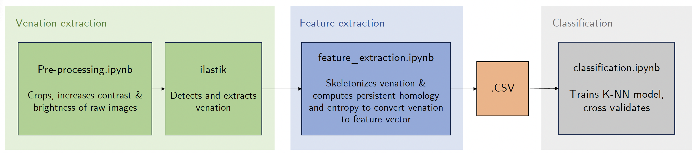

# Plant species identification using persistent homology

## Abstract

We investigate whether the venous structure of a plant’s leaf can be used to identify its species. In particular, we train a K-NN model using the persistent entropy, a scalar associated to persistence diagrams, of the venous structure of leaves from four species of plants as features. The final model was trained on the persistent entropy of 160 plant leaves and achieved a maximal average accuracy of 0.813, answering the question in the affirmative in our limited study.

See the full write-up [here](documents/report.pdf).

## Code structure

The code contents of the project is separated in to three Jupyter notebooks run in consequtive order

1. [preprocess.ipynb](preprocess.ipynb)
2. [feature_extraction.ipynb](feature_extraction.ipynb)
3. [classifier.ipynb](classifier.ipynb)

